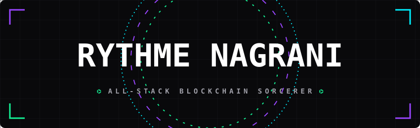

<!-- ┌──────────────────────────────────────────────────────────────┐
     │  RYTHMERN02 · PROFILE OS v2026.7                             │
     │  if you're reading the raw markdown, you're my kind of       │
     │  person. star something before you leave.                    │
     └──────────────────────────────────────────────────────────────┘ -->

<div align="center">

<picture>
  <source media="(prefers-color-scheme: dark)" srcset="./banner.svg" />
  <source media="(prefers-color-scheme: light)" srcset="./banner.svg" />
  
</picture>

<a href="https://github.com/rythmern02">
  
</a>

<br/>


&nbsp;
<a href="https://github.com/rythmern02?tab=followers"></a>
&nbsp;


</div>

## ⌬ SYSTEM SCAN >_ `whoami`

```rust
// $ cargo run --release -- --identity

pub struct Rythme;

impl BlockchainSorcerer for Rythme {
    const BASE: &'static str = "India 🇮🇳 — building for everywhere";

    fn roles() -> [&'static str; 3] {
        ["All-Stack Blockchain Dev", "Technical Founder", "Community Architect"]
    }

    fn chains() -> Vec<Chain> {
        vec![Solana, Starknet, Ethereum, Rootstock, Initia]
    }

    fn dark_arts() -> Vec<&'static str> {
        vec!["ZK-Proofs", "ERC-4337 / Account Abstraction", "MPC (Nillion)", "AI × Crypto"]
    }

    fn current_quest() -> &'static str {
        "Scaling confidential ZK infrastructure & shipping consumer crypto \
         that normies actually open twice"
    }

    fn fun_fact() -> ! {
        panic!("I debug decentralized infrastructure faster than I debug my life 🐛")
    }
}
```

<div align="center">

</div>

## ◢◤ 2026 DIRECTIVES >_ `systemctl status rythme.service`

| STATUS | MISSION | LOAD |
|:---:|:---|:---|
| `⣾ RUNNING` | Scale confidential **ZK-payroll rails** — taking Civitas multichain | `▰▰▰▰▰▰▰▱▱▱` |
| `⣾ RUNNING` | Ship **consumer crypto** with UX so clean the chain disappears | `▰▰▰▰▰▰▱▱▱▱` |
| `⚙ BUILDING` | **ERC-4337 / AA tooling** — wallets that feel like apps, not hardware | `▰▰▰▰▰▱▱▱▱▱` |
| `⚡ CHARGING` | **AI × Crypto** — agents that label, predict, and pay for themselves | `▰▰▰▰▱▱▱▱▱▱` |
| `∞ ALWAYS` | Grow **Web3Spell** past 100 events · **SpellCast** season two | `▰▰▰▰▰▰▰▰▱▱` |

<div align="center">

</div>

## ⟁ FLAGSHIP BUILDS >_ `ls -la /dev/shipped`

<table width="100%">
<tr>
<td width="50%" valign="top">
<h3 align="center">🕶️ CIVITAS</h3>
<p align="center"><b>Zero-Knowledge Confidential Payroll</b></p>
<p align="center">Pay your team on-chain without doxxing a single salary. MPC secrets via Nillion, ZK rails underneath. Born on <b>Starknet Sepolia</b> → expanded to <b>Solana</b> for the Colosseum Frontier Hackathon (Apr 2026).</p>
<p align="center">


</p>
<p align="center">
<a href="https://github.com/MeetCivitas/Civitas-Sol"></a>
<a href="https://meetcivitas.xyz"></a>
</p>
</td>
<td width="50%" valign="top">
<h3 align="center">🏺 CHAINPOT</h3>
<p align="center"><b>On-Chain ROSCA Savings Circles</b></p>
<p align="center">Trustless rotating savings — community circles with VRF draws, business pots with discount bids, settled in USDC. Backed by a <b>$17,000 Compound Protocol grant</b> via Questbook · <b>Top 500, Thrive Power List</b> (Jan 2026).</p>
<p align="center">


</p>
<p align="center">
<a href="https://github.com/Web3spell/chainpot"></a>
<a href="https://chainpot.fun"></a>
</p>
</td>
</tr>
<tr>
<td width="50%" valign="top">
<h3 align="center">🏷️ LABELO</h3>
<p align="center"><b>B2B AI Data-Labeling, On-Chain</b></p>
<p align="center">Where AI supply chains meet crypto incentives — a data-labeling platform built on the <b>Initia testnet</b> for the DoraHacks <b>INITIATE</b> Hackathon. Label data, earn on-chain, feed the models.</p>
<p align="center">


</p>
<p align="center"><a href="https://github.com/rythmern02/Labelo"></a></p>
</td>
<td width="50%" valign="top">
<h3 align="center">🌌 SKYSCREEN</h3>
<p align="center"><b>Decentralized Display Infrastructure</b></p>
<p align="center">Exploring the TypeScript territory for decentralized screen sharing and peer-to-peer data streaming. Fast, lightweight, and fully permissionless.</p>
<p align="center">


</p>
<p align="center"><a href="https://github.com/rythmern02/skyscreen"></a></p>
</td>
</tr>
<tr>
<td colspan="2" valign="top">
<h3 align="center">⚒️ ROOTSTOCK BUILDER ROOTCAMP ⚙️ THE TOOLBOX</h3>
<p align="center"><b>Bitcoin-secured smart contracts deserve better DX. So I built it.</b></p>
<p align="center">Shipped a <b>Foundry Deployer Action</b>, a <b>Java RNS Resolver</b>, a <b>Refuel Kit widget</b> — plus <b>Fee-Radar</b> (surfaces peg-out costs) and <b>Permit-Wiz</b> (gasless RIF Relay tx debugging). Also authored the <b>LI.FI integration guide</b> for the RSK Dev Portal.</p>
<p align="center">


</p>
<p align="center">
<a href="https://github.com/rythmern02/Fee-Radar"></a>
<a href="https://github.com/rythmern02/Permit-Wiz"></a>
<a href="https://github.com/rythmern02/Rootstock-Paymaster-Kit"></a>
<a href="https://dev.rootstock.io/ko/use-cases/interoperability/integrate-lifi/"></a>
</p>
</td>
</tr>
</table>

### ⧉ FRESH FROM THE LAB

<div align="center">

<a href="https://github.com/rythmern02/Fee-Radar"></a>
<a href="https://github.com/rythmern02/Permit-Wiz"></a>

<a href="https://github.com/rythmern02/x402-ASP"></a>
<a href="https://github.com/rythmern02/coffee-stylus-contract"></a>

<a href="https://github.com/rythmern02/Labelo"></a>
<a href="https://github.com/Web3spell/chainpot"></a>

</div>

<details>
<summary>&nbsp;⛃ <b>decrypt: the deeper archive</b> ;) <i>click if you dare</i></summary>
<br/>

- ⚗️ [**liveness-vault**](https://github.com/rythmern02/liveness-vault) — Solidity experiments in vault liveness
- 🎰 [**MysticPool**](https://github.com/rythmern02/MysticPool) — the enchanted on-chain 8-ball
- 🕵️ [**APSP**](https://github.com/rythmern02/APSP) — Anonymous Proof Submission Platform
- 🧿 [**SorcerersCue**](https://github.com/rythmern02/SorcerersCue) · [**AurumVera**](https://github.com/rythmern02/AurumVera) — Rust sorcery
- 🏠 [**housie**](https://github.com/rythmern02/housie) — property rental/sale dApp
- 💳 [**InstaCredit**](https://github.com/rythmern02/InstaCredit) — mobile credit, Dart-side
- 🔗 [**BlockCircle**](https://github.com/rythmern02/BlockCircle) · [**Swarm-Broker**](https://github.com/rythmern02/Swarm-Broker) · [**skyscreen**](https://github.com/rythmern02/skyscreen) — TypeScript territory

</details>

<div align="center">

</div>

## ⛓ THE ARSENAL >_ `nvim ~/.stack`

<div align="center">

### ⟨ languages ⟩


### ⟨ frontend × mobile ⟩


### ⟨ backend × infra ⟩


### ⟨ the chains i haunt ⟩


### ⟨ dark arts ⟩


</div>

<div align="center">

</div>

## ✦ THE MOVEMENT >_ `sudo systemctl enable community`

<table width="100%">
<tr>
<td width="50%" valign="top" align="center">
<h3>🧙 WEB3SPELL</h3>
<p><b>Grassroots Web3, straight outta the heartland.</b></p>
<p>Founded and scaled a builder community that has run <b>65+ developer events</b> — hackathons, ZK workshops, and protocol deep-dives — across <b>Bhopal & Vidisha, India</b>. Turning tier-2 cities into tier-1 talent pipelines.</p>
<p>


</p>
</td>
<td width="50%" valign="top" align="center">
<h3>🎙️ SPELLCAST</h3>
<p><b>The podcast where builders spill the alpha.</b></p>
<p>Creator & host of <b>SpellCast</b> — long-form conversations with the people actually shipping the decentralized future. Raw takes, real war stories, zero fluff.</p>
<p>
<a href="https://youtube.com/playlist?list=PLPvD5K6HssNA&si=aGpJhJbhb2_3NooL">

</a>
</p>
</td>
</tr>
</table>

<div align="center">

</div>

## ⚔️ TROPHY SHELF >_ `cat /var/log/wins.log`

| ⌁ | ACHIEVEMENT UNLOCKED | DATE |
|:---:|:---|:---:|
| 🏆 | **Token 2049 Origins Hackathon** >_ Track Winner [x.com/CeloDevs/status/1973706736172507156](https://x.com/CeloDevs/status/1973706736172507156) | 2024 |
| 💰 | **$17,000 grant** >_ Compound Protocol via Questbook, for Chainpot | 2025–26 |
| ⚡ | **Top 500 >_ Thrive Power List** | Jan 2026 |
| 🛡️ | **Colosseum Frontier Hackathon** >_ shipped Civitas on Solana | Apr 2026 |
| 🤖 | **DoraHacks INITIATE** >_ shipped Labelo on Initia testnet | 2026 |
| ⚒️ | **Rootstock Builder Rootcamp** >_ Foundry Action · RNS Resolver · Refuel Kit | 2026 |
| 🎙️ | **65+ community events** hosted under Web3Spell | ongoing |

<div align="center">

</div>

## 📡 TRANSMISSIONS >_ `tail -f ~/writing.log`

- ▸ [Why your crypto needs more than one key — Polkadot multisig, the real story](https://rythme.hashnode.dev/why-your-crypto-needs-more-than-one-key-the-real-story-of-polkadot-multisig-wallets)
- ▸ [Wormhole: bridging the fragmented Web3 landscape](https://rythme.hashnode.dev/wormhole-bridging-the-fragmented-web3-landscape)
- ▸ [Okto SDK: your ticket to the Web3 multiverse](https://medium.com/@rythmenagrani/okto-sdk-your-ultimate-ticket-to-the-web3-multiverse-87a3cb2e6324)
- ▸ [Solana: a saga of innovation, resilience & vision](https://medium.com/@rythmenagrani/solana-a-saga-of-innovation-resilience-and-a-vision-for-the-future-a41010034b99)

<div align="center">

</div>

## ▓ DAMAGE REPORT >_ `htop --user=rythmern02`

<div align="center">


<br/><br/>


<br/><br/>


<br/><br/>


<picture>
  <source media="(prefers-color-scheme: dark)" srcset="https://raw.githubusercontent.com/rythmern02/rythmern02/output/github-contribution-grid-snake-dark.svg" />
  <source media="(prefers-color-scheme: light)" srcset="https://raw.githubusercontent.com/rythmern02/rythmern02/output/github-contribution-grid-snake.svg" />
  
</picture>

</div>

<div align="center">

</div>

## ⌖ OPEN A CHANNEL >_ `ping rythme`

<div align="center">

<a href="https://www.linkedin.com/in/rythmern/"></a>
<a href="https://www.twitter.com/rythmern"></a>
<a href="https://rythme.hashnode.dev"></a>
<a href="https://www.medium.com/@rythmenagrani"></a>
<a href="https://youtube.com/playlist?list=PLPvD5K6HssNA&si=aGpJhJbhb2_3NooL"></a>

<br/><br/>

### ⟠ fuel the lab

<a href="https://solscan.io/rythme.sol"></a>
<a href="https://etherscan.io/address/0xbA965BeBCfE338Fb92438EB50eaDFB38878Cfa8b"></a>

<br/>


</div>

<div align="center">


**⭐ star something before you bounce — the algorithm and I both appreciate it.**


</div>
